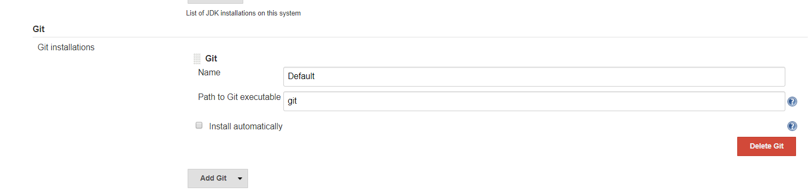
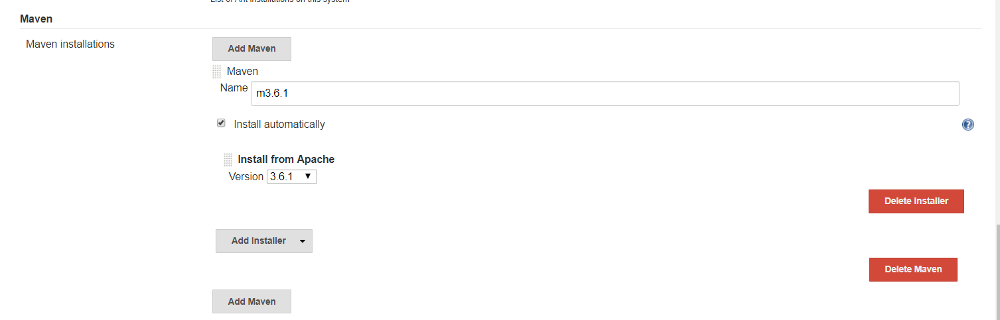
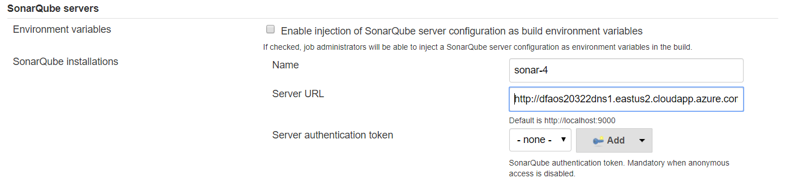
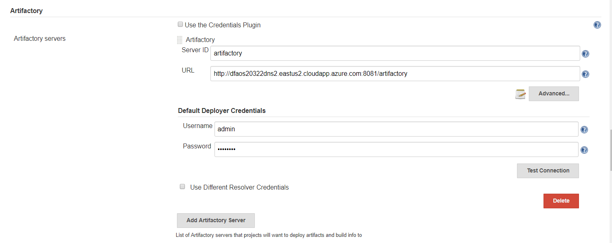
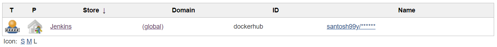
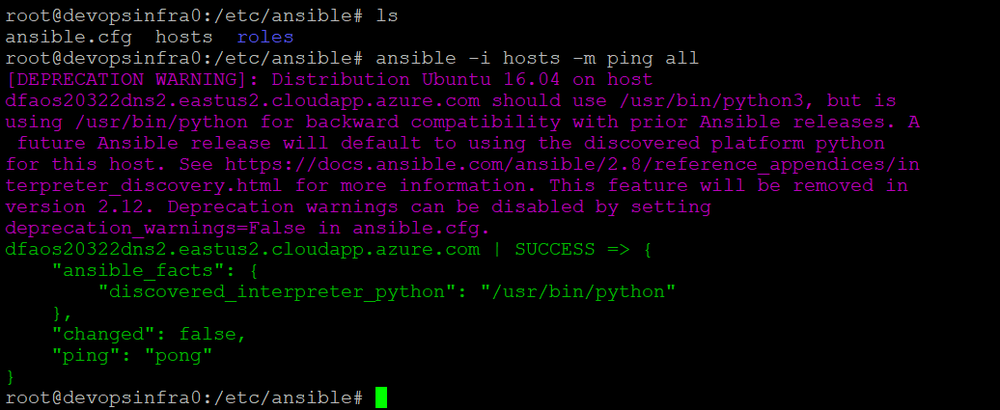
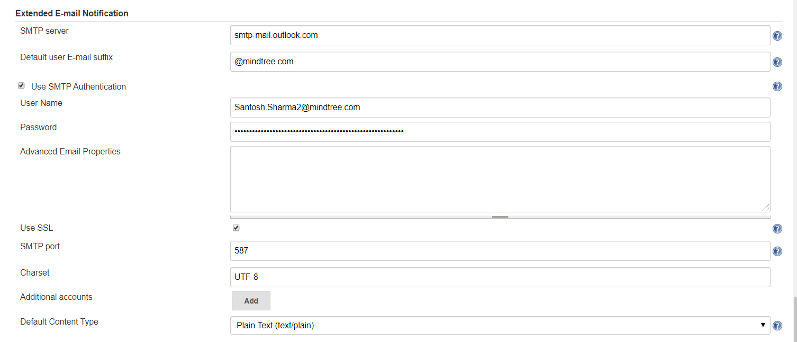
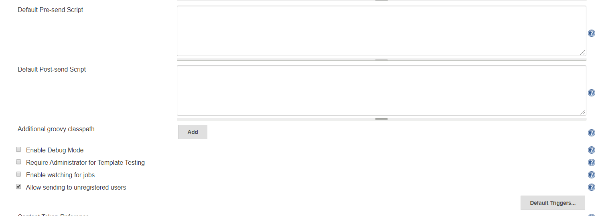

# Jenkins CI CD Pipeline Using Pipeline as Code #

Clone or fork the sample spring boot [spring-petclinic](https://github.com/spring-projects/spring-petclinic) project which is used to CI CD.

Three VMs have been used for this Hands On:
* dfaos20322dns0.eastus2.cloudapp.azure.com ----> vm0
* dfaos20322dns1.eastus2.cloudapp.azure.com ----> vm1
* dfaos20322dns2.eastus2.cloudapp.azure.com ----> vm2

## Goal ##

Create Jenkins shared library for templatization.

With every commit to the source repo the jenkins job has to be triggered which will execute the following pipeline stages:

1. **Checkout** : It will pull the code from the source repository. 

2. **Sonar-Analysis**  : It will scan the repository for checking Code quality.

3. **Sonar Quality Gate**  : If the sonar coverage is more than 70% then the stage passes otherwise fails.

4. **Build** : It builds the spring boot project and package it as jar file.

5. **Artifact upload using Artifactory** : It uploads the the jar to the Artifcatory.

6. **Artifact download using Artifactory** : It downloads the jar from artifactory
to the vm2.

6. **Docker Build and Push to Docker hub** : It creates the docker image of spring-petclinic app and push to docker hub.

7. **Docker Pull and Deploy** : Pull image from docker hub and deploy the app to vm0.

8. **Deploy Using Ansible** :

9. **Notify** : Notify user in case of failed/successfull build.

## Tools and Plugins Configurations in Jenkins

The Jenkins, Docker and Ansible are installed and configured in vm0.
SonarQube is installed and configured in vm1.
Artifactory is installed and configured in vm3.

1. **Git**  
    
    
2. **Maven Configuration**
    

3. **Sonar Configuration**

4. **Artifactory Configuration**

5. **Docker Configuration**  
Create Docker Hub credentials in Jenkins.  
Jenkins -> Credentials -> System -> Global credentials -> Add Credentials -> Fill the required details -> OK  

6. **Ansible Configuration**  
    Create connection between vm0 and vm2. Mention vm2 in ansible inventory(Edit etc/ansible/hosts).  
    `[vms]`  
    `dfaos20322dns2.eastus2.cloudapp.azure.com`  

    Check the connection.  
    `ansible -i hosts -m ping all`
    

7. **Mail Configuration**
    Install and configure Email Extension plugin.
    

     

## Webhooks Creation

* **GitHub**  
    Open Source repo -> Settings -> Webhooks -> Add webhook  
    Payload URL: `http://dfaos20322dns0.eastus2.cloudapp.azure.com:8080/github-webhook/`
    
* **SonarQube**   
    Open Sonarqube -> Administration -> Webhooks  
    Name : `jenkins`  
    URL: `http://dfaos20322dns0.eastus2.cloudapp.azure.com:8080/github-webhook/`

